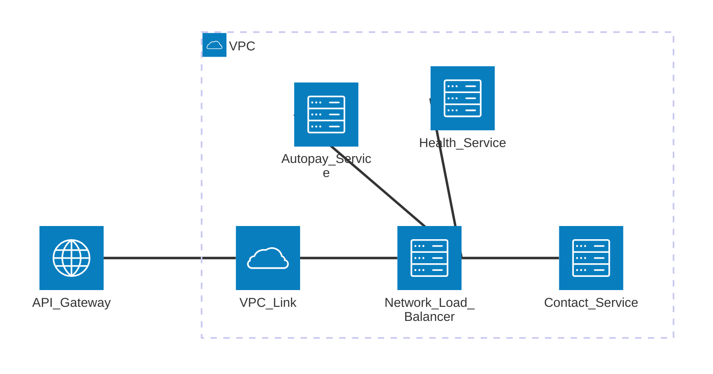

```mermaid
architecture-beta
    %% Define the VPC group
    group vpc(cloud)[VPC]

    %% Define API Gateway (External)
    service api_gateway(internet)[API_Gateway]

    %% Define VPC Link inside VPC
    service vpc_link(cloud)[VPC_Link] in vpc

    %% Define Network Load Balancer inside VPC
    service nlb(server)[Network_Load_Balancer] in vpc

    %% Define Backend Services inside VPC
    service health_service(server)[Health_Service] in vpc
    service autopay_service(server)[Autopay_Service] in vpc
    service contact_service(server)[Contact_Service] in vpc

    %% Define connections
    api_gateway:R -- L:vpc_link
    vpc_link:R -- L:nlb
    nlb:R -- L:health_service
    nlb:R -- L:autopay_service
    nlb:R -- L:contact_service
```