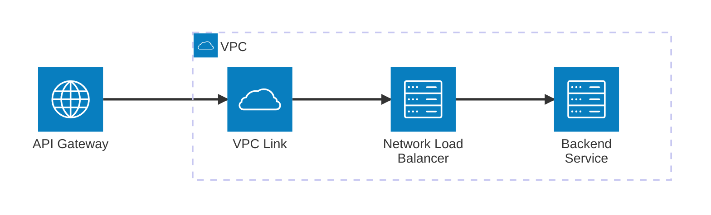

```mermaid
architecture-beta
    %% Define the VPC group
    group vpc(cloud)[VPC]

    %% Define the API Gateway outside the VPC
    service api_gateway(internet)[API Gateway]

    %% Define the VPC Link within the VPC
    service vpc_link(cloud)[VPC Link] in vpc

    %% Define the Network Load Balancer within the VPC
    service nlb(server)[Network Load Balancer] in vpc

    %% Define the backend service (e.g., ECS Service) within the VPC
    service backend_service(server)[Backend Service] in vpc

    %% Define connections
    api_gateway:R --> L:vpc_link
    vpc_link:R --> L:nlb
    nlb:R --> L:backend_service
```