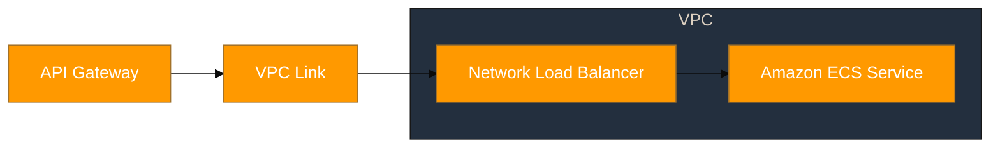

```mermaid
%%{init: {"theme": "base", "themeVariables": {"primaryColor": "#FF9900", "edgeLabelBackground": "#ffffff", "tertiaryColor": "#232F3E", "primaryTextColor": "#ffffff", "fontFamily": "Arial"}}}%%
flowchart LR
    subgraph VPC
        direction TB
        NLB[Network Load Balancer]
        ECS[Amazon ECS Service]
        NLB --> ECS
    end
    APIGW[API Gateway] --> VPCLink[VPC Link]
    VPCLink --> NLB
```